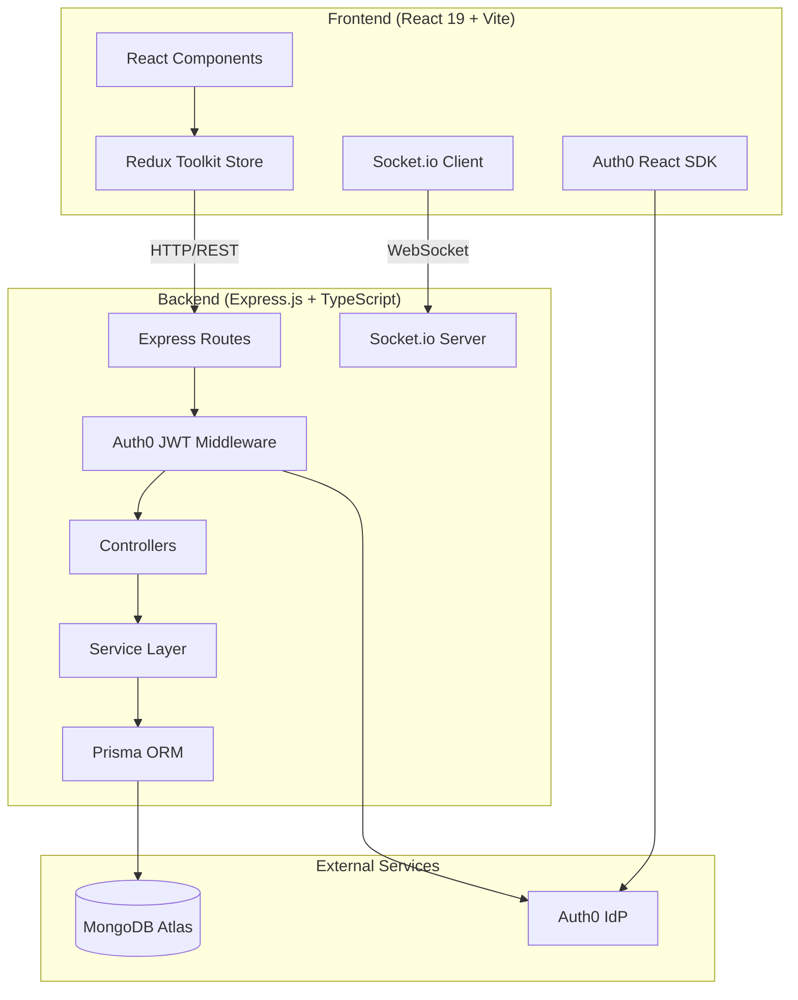
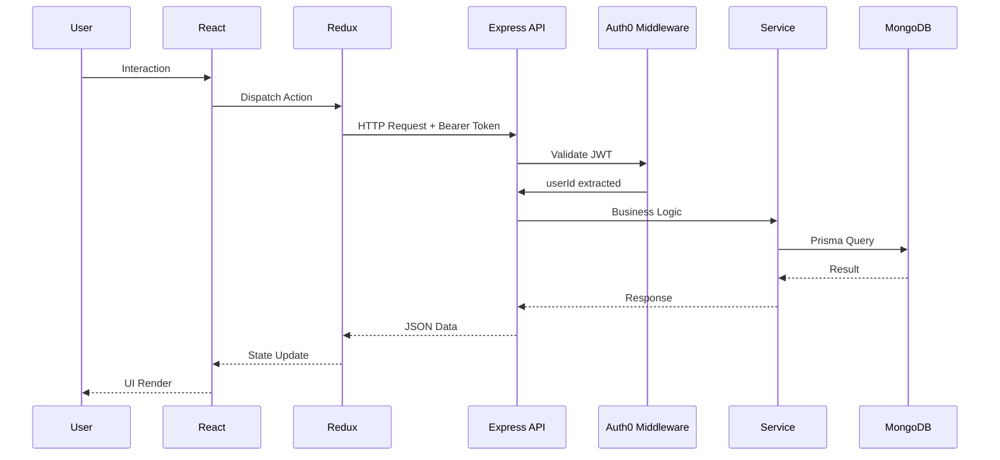
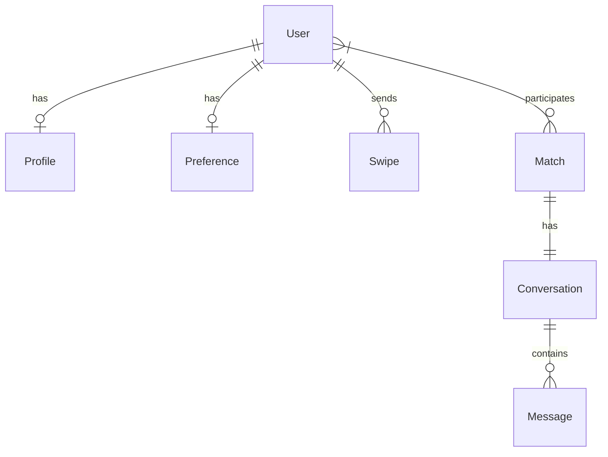

# Flately — System Architecture

## Overview

Flately is a roommate-matching application built on a modern full-stack TypeScript architecture. The system follows a **modular monolith** pattern on the backend with a **feature-based** frontend structure.

## System Architecture



## Backend Module Map

```
backend/src/
├── config/          # Environment & Prisma client
├── middlewares/     # Auth0 JWT validation
├── types/           # Shared TypeScript types
└── modules/
    ├── users        # User CRUD (Auth0 sync)
    ├── profiles/    # Profile management
    ├── preferences/ # Matching preferences
    ├── discovery/   # Feed & swipe actions
    ├── matching/    # Compatibility algorithm
    ├── matches/     # Match lifecycle
    └── chat/        # Messages + Socket.io
```

Each module follows the pattern: `routes → controller → service → Prisma`.

## Data Flow



## Key Design Decisions

| Decision | Choice | Rationale |
|----------|--------|-----------|
| Database | MongoDB Atlas | Flexible schema for user profiles, Prisma ORM support |
| Auth | Auth0 | Managed OAuth2/JWT, social login, zero custom auth code |
| Real-time | Socket.io | Bi-directional messaging, room-based conversations |
| State | Redux Toolkit | Predictable state, devtools, slices pattern |
| Styling | Tailwind CSS v4 | `@theme` directive, OKLCH colors, fluid typography |
| Validation | Zod | Runtime + compile-time validation, env vars |
| Build | Vite | Fast HMR, native ESM, React plugin |

## Entity Relationships



## Environment Variables

Validated at startup via Zod in `config/env.ts`:

| Variable | Required | Default | Description |
|----------|----------|---------|-------------|
| `PORT` | No | `4000` | Server port |
| `DATABASE_URL` | **Yes** | — | MongoDB connection string |
| `AUTH0_DOMAIN` | **Yes** | — | Auth0 tenant domain |
| `AUTH0_AUDIENCE` | **Yes** | — | Auth0 API audience |
| `FRONTEND_URL` | No | `http://localhost:5173` | CORS origin |
